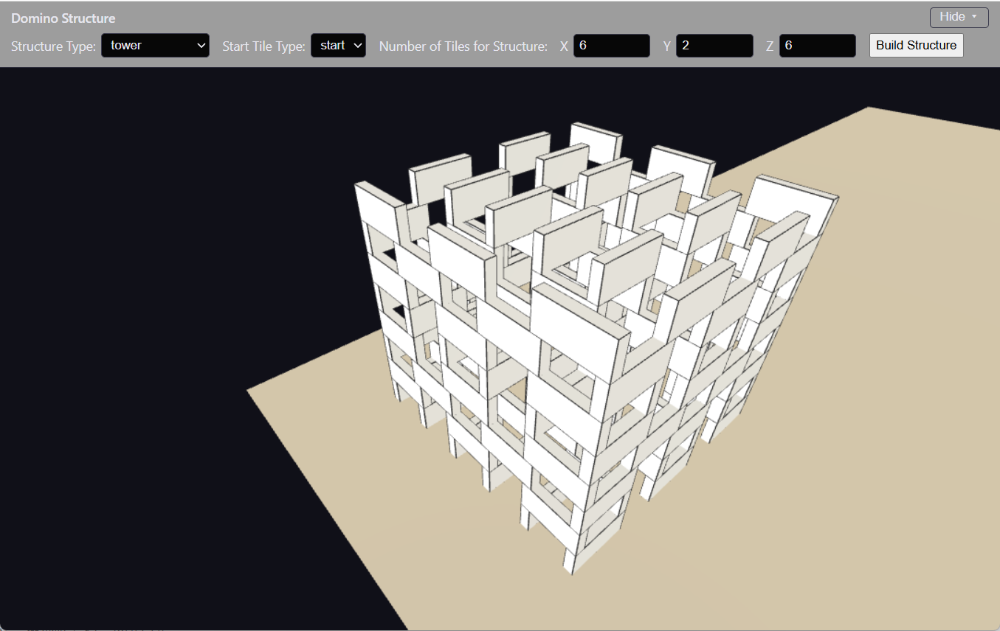

# Domino3D - Virtual 3-D Domino Structures



## 1. Introduction and purpose

Domino3D is an experimental project for designing and visualizing 3D domino structures —
walls, towers, and other repeating patterns built out of standard dominoes. This was a 
starter project for me (Paul) to learn how to code with Claude and to see how far I could get
with showing and rotating 3-dimensional domino structures.

The answer was:  Quite far! This whole thing took about three days to create, which is, frankly, insane.

This project is now archived - it will not be further developed. I'm going to move onto other,
more generally useful, projects. However, I will plunder this project for its code (and you are
welcome to do the same!).

### Domino Patterns

One of the main ideas of the project was to create a JSON structure for specifying domino patterns.
I created a specification (dimensions.md and patterns.md) and pattern files for a number of common
structures.

However, many other domino structures (speed walls, hexagons, square-wave walls, etc.) are not possible
with the pattern language I created. It could be extended, of course, but I think I will shift my 
focus into creating some sort of language which can be built graphically - i.e. with some user-friendly
interface to create new patterns rather than the (frankly obtuse) JSON structure I created.

But I may continue to use this structure for other projects in the mean time, since I have a lot of
ideas of what to do with simple walls and towers.

### Tiles vs dominos and layers

The size of the structures is in number of "tiles". This has to do with how the patterns are specified.

What will you will mostly notice is that when you specify "Y = 1" you actually get four layers. This is because 
tiling patterns specify all four layers, so a single tile gives you four layers of dominoes. My thought was to
someday include a post-processing routine to remove / limit the dominoes by layers, but that task will be
left undone.

### What you can do with this program

You choose a structure type, a starting tile type, and how many tiles wide/tall/deep to build, and the
scene renders the resulting arrangement of dominoes in 3D using [Three.js](https://threejs.org/),
so you can orbit, pan, and zoom around it.

The structure logic is data-driven: domino dimensions and "patterns" (repeatable tile
layouts like `wall`, `tower`, `step-wall`, etc.) are defined in JSON files under
[static/data/](static/data/), described in [static/data/dimensions.md](static/data/dimensions.md)
and [static/data/patterns.md](static/data/patterns.md). Adding a new pattern is a matter of
adding a new JSON file — no code changes required to use it (aside from listing it in the
Structure Type dropdown; see part 4).

The app can run two ways:
- **Fully offline**, with no server at all — just double-click the "index_click_this_one.html" file.
- **Served locally** by a small [FastAPI](https://fastapi.tiangolo.com/) app, which is
  the more convenient setup while actively developing (auto-restart on changes, no
  build step needed).

Both are covered below.

### Who am I?

Paul Nelson, a domino guy. For more information, see my [linktree](https://linktr.ee/PaulLovesDominoes).

## 2. Download and run without a server

This is the fastest way to try the app — no Python, no Node.js, no installation at all.

1. Download the repository (via `git clone`, or GitHub's "Download ZIP").
2. Open **[static/index_click_this_one.html](static/index_click_this_one.html)** directly
   in a browser (double-click it, or drag it into a browser window).

That's it. This file loads a pre-built, self-contained bundle
(`static/dist/bundle.js` and `static/dist/data.js`, already committed to the repo) that
includes Three.js and the entire domino data model inlined — nothing is fetched over the
network, so it works from a `file://` URL with zero setup.

> **Why is there a separate file for this?** Modern browsers block ES module script
> loading and `fetch()` requests when a page is opened via `file://` (no server), which
> is what [static/index.html](static/index.html) normally relies on. `index_click_this_one.html`
> sidesteps that by loading a single pre-bundled script instead — see part 4 if you're
> changing code and need to know when to regenerate that bundle.

## 3. Download and run with a FastAPI server

This is the recommended setup for further development and expansion — editing HTML/JS files
takes effect on a simple browser refresh, no rebuild step required.

**Prerequisite:** [Python 3](https://www.python.org/downloads/) (3.9+).

1. Download the repository (via `git clone`, or GitHub's "Download ZIP").
2. Install dependencies:
   ```
   pip install -r requirements.txt
   ```
3. Start the server:
   ```
   start_server.bat
   ```
   (or directly: `python -m uvicorn main:app --reload`)
4. Browse to **http://127.0.0.1:8000**.

The server (`main.py`) is a thin static file server — it has no API endpoints or
database, it just serves the `static/` folder and returns `static/index.html` at `/`.
All the actual behavior lives in the browser-side JavaScript.

`--reload` auto-restarts the server when `main.py` changes, but it does **not**
auto-refresh your browser, and static files (HTML/JS/JSON) are always read fresh from
disk on every request — so after editing anything under `static/`, just reload the page
(a hard refresh if a file seems stale/cached).

## 4. Download and set up for additional coding

To modify the code, run the unit tests, or regenerate the offline bundle, you will need:

- **[Python 3](https://www.python.org/downloads/)** (3.9+) — runs the FastAPI server.
- **[Node.js](https://nodejs.org/)** (18+) — runs the unit test suite and the offline
  bundler. Includes `npm`.

Setup:
```
pip install -r requirements.txt
npm install
```

### Running the tests
```
run_tests.bat
```
or `npm test`, or `node --test`. No dependencies beyond Node itself — the suite uses
Node's built-in test runner and reads the real `static/data/*.json` fixtures directly
from disk.

### Adding a new structure pattern
1. Add a new JSON file under `static/data/patterns/`, following the schema in
   `static/data/patterns.md`.
2. Add it to the **Structure Type** dropdown (and its start-tile list) in *both*
   `static/index.html` and `static/index_click_this_one.html` — these are hard-coded in
   each file (not generated), so both need the same manual edit.
3. If you also use the offline entry point, regenerate the bundle (next section) so the
   new pattern's data is embedded.

### Regenerating the offline bundle
`static/dist/bundle.js` and `static/dist/data.js` are **committed to the repo** (not
gitignored) so that a fresh download of `index_click_this_one.html` works immediately,
with no build step. This means they can go stale — there's no CI to catch it
automatically. **Whenever you change `scene.js`, `structure_builder.js`, or any file
under `static/data/`, re-run the build and commit the result:**
```
build_offline.bat
```
or `npm run build`. This uses [esbuild](https://esbuild.github.io/) to bundle Three.js +
`OrbitControls` + `scene.js` + `structure_builder.js` into one self-contained script, and
embeds every `static/data/**` JSON file so the offline page needs no network access.
